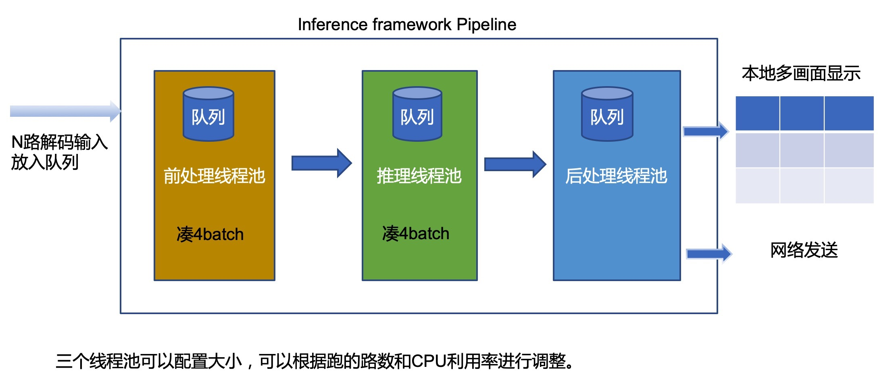

# Inference介绍

Inference 提供一个简易的基于Pipeline的高性能加速框架，使用该框架能够将前处理/推理/后处理分别运行在3个线程上，最大化的实现并行, 用户只需要继承一个类，然后实现自己的前处理/后处理/就可以实现整个流程了。

主要目录结构和模块说明：
| 目录 | 功能说明 
|---|---| 
|[bmgui-lite](./bmgui-lite) | 由于BMNNSDK2自带的OpenCV没有显示功能，此模块提供bm:imshow来显示视频，作为补充。
|[bmgui](./bmgui) | 存放Inference用来GUI显示视频的模块 
|[bmutility](./bmutility) | 提供了特别多的基础库，字符串、定时器等
|[cvs10](./cvs10) | 提供了算能一路的参考实现
|[ddr_reduction](./ddr_reduction) | 提供一种节约DDR占用的软件实现方案

Inference的主要结构设计如下图： 



# 示例代码集成使用说明

目录examples下有想相关的例子可以参考。目前提供了如下例子：
| 目录 | 说明 | 模型个数
|---|---|---| 
| face_detect | Sequeezenet 人脸检测  | 1
| face_recognition | 演示多个模型如何串联 | 3
| openpose | OpenPose 18个关键点 | 1
| retinaface | Retinaface 人脸检测 | 1
| yolov5 | yolov5s 对象检测 | 1

# 编译方法
## 依赖安装
Inference framework 依赖 BMNNSDK2. 请到算能官网（www.sophgo.com) 进行下载，解压、安装。  bmnnsdk2的安装方法可以参考如下链接： 
> https://sophgo-doc.gitbook.io/bmnnsdk2-bm1684/

> Ubuntu 16.04 安装QT依赖：
````
sudo apt install qtbase5-dev
````

> Tracker 功能需要安装 Eigen 依赖：
```
sudo apt-get install -y libeigen3-dev
```

> Retinaface 模块需要安装 glog/exiv2 依赖：
```
sudo apt-get install -y libgoogle-glog-dev libexiv2-dev
```
## 编译指令
---
1. export REL_TOP=$bmnnsdk_dir 根据实际位置修改为BMNNSDK跟路径
2. 各个平台编译
   ---
   > **NOTE**  
   如果需要本地显示最终的结果需要手工编辑./compile.sh 找到USE_QTGUI 选项， 设置为ON。
   SOC平台，需要下载自定义的QT支持库，可以联系技术支持。
   
   > TARGET_ARCH=x86 表示x86平台
   TARGET_ARCH=soc 表示小盒子上编译
   TARGET_ARCH=arm64 表示国产ARM CPU上编译
   
   > appname=face_detect 人脸检测
     appname=openpose    人体骨骼检测
     appname=yolov5      物体检测
     appname=retinaface  人脸检测
     
   ```` bash
   ./compile.sh [target_arch]
   example: ./compile.sh x86 # x85平台
   ./compile.sh soc # SOC平台
   ````
   
   
## 运行方法
---
   > cd ./release/facedetect_demo

   > ./x86/facedetect_demo --help 查看命行帮助信息     

相关模型请从下面网盘下载，如有问题，请联系技术支持 
   
   链接：https://pan.baidu.com/s/16d5E_NTj4ubVPkPmR6GG5A 
   提取码：sp2w 

## 客户端服务器模式运行
---
> 演示程序支持远程显示，应用于SE5/SM5等没有本地界面的平台，检测程序在设备端进行检测，然后讲结果发送到一个指定的目的地址，客户端负责接收带有结果的流，然后显示。
具体配置方法，请参考[SE5-OpenPose-Demo配置文档.docx](./SE5-OpenPose-Demo-Config.docx)  

> 客户端的源代码请参考如下链接：https://github.com/sophon-ai-algo/face_demo_client

