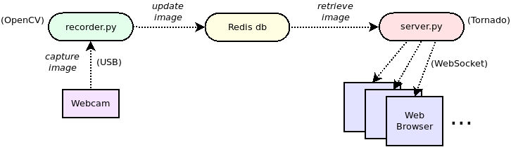

使用websocket推送图片流显示的Demo

## 简介

依赖：OpenCV、redis-server、tornado、websocket



## 安装依赖

1. 安装redis-server依赖：

   ```bash
   sudo apt install redis-server
   ```

2. 安装python依赖：

   ```bash
   sudo pip3 install -r requirements.txt
   ```

3. 修改pull_frame.py 中的RTSP_URL

## 启动程序

启动程序：

```bash
python3 main.py
```

## 查看画面

打开浏览器查看： http://<box_ip>:8000


### 其他参考例程

https://github.com/vmlaker/hello-websocket

