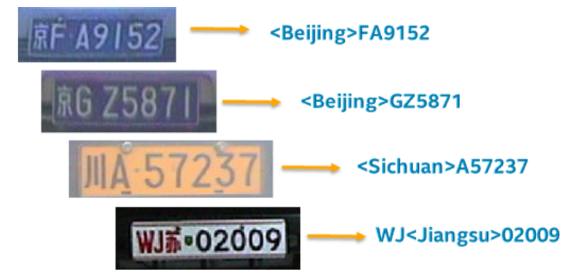

# LPRNet

## 目录

* [LPRNet](#LPRNet)
  * [目录](#目录)
  * [1. 简介](#1-简介)
  * [2. 数据集](#2-数据集)
  * [3. 准备工作](#3-准备工作)
    * [3.1 准备移植例程](#31-准备移植例程)
    * [3.2 准备开发环境](#32-准备开发环境)
    * [3.3 准备模型与数据](#33-准备模型与数据)
  * [4. 模型转换](#4-模型转换)
    * [4.1 生成FP32 BModel](#41-生成fp32-bmodel)
    * [4.2 生成INT8 BModel](#42-生成int8-bmodel)
  * [5. 推理测试](#5-推理测试)
    * [5.1 环境配置](#51-环境配置)
    * [5.2 C++例程推理](#52-C++例程推理)
    * [5.3 Python例程推理](#53-Python例程推理)
    * [5.4 精度与性能测试](#54-精度与性能测试)
  * [6. 流程化部署](#6-流程化部署)
  * [7. 自动化测试](#7-自动化测试)
  * [8. LICENSE](#8-LICENSE)
  * [9. 参考链接与文献](#9-参考链接与文献)


## 1. 简介

LPRNet(License Plate Recognition via Deep Neural Networks)，是一种轻量级卷积神经网络，可实现无需进行字符分割的端到端车牌识别。  
LPRNet的优点可以总结为如下三点：  
(1)LPRNet不需要字符预先分割，车牌识别的准确率高、算法实时性强、支持可变长字符车牌识别。对于字符差异比较大的各国不同车牌均能够端到端进行训练。  
(2)LPRNet是第一个没有使用RNN的实时轻量级OCR算法，能够在各种设备上运行，包括嵌入式设备。  
(3)LPRNet具有足够好的鲁棒性，在视角和摄像畸变、光照条件恶劣、视角变化等复杂的情况下，仍表现出较好的识别效果。 



**论文:** [LNRNet论文](https://arxiv.org/abs/1806.10447v1)

**参考repo:** [LNRNet_Pytorch](https://github.com/sirius-ai/LPRNet_Pytorch)

在此非常感谢Sergey Zherzdev、 Alexey Gruzdev、 sirius-ai等人的贡献，提高了本repo工作的效率。


## 2. 数据集

[LNRNet论文](https://arxiv.org/abs/1806.10447v1)中没有提供数据集的具体来源。[LNRNet_Pytorch](https://github.com/sirius-ai/LPRNet_Pytorch)中提供了一个节选至CCPD的车牌测试集，数量为1000张，图片名为车牌标签，且图片已resize为24x94，本工程以此作为测试集。

[CCPD](https://github.com/detectRecog/CCPD)，是由中科大团队构建的一个用于车牌识别的大型国内停车场车牌数据集。该数据集在合肥市的停车场采集得来，采集时间早上7:30到晚上10:00。停车场采集人员手持Android POS机对停车场的车辆拍照并手工标注车牌位置。拍摄的车牌照片涉及多种复杂环境，包括模糊、倾斜、阴雨天、雪天等等。CCPD数据集一共包含将近30万张图片，每种图片大小720x1160x3。


## 3. 准备工作
### 3.1 准备移植例程
我们可以从github上下载移植好的例程，LPRNet的例程位于examples/simple/lprnet/。
```
git clone https://github.com/sophon-ai-algo/examples.git
```
### 3.2 准备开发环境

模型转换验证和程序编译必须在开发环境中完成，我们需要一台x86主机作为开发环境，并且在我们提供的基于Ubuntu18.04的docker镜像中，使用我们的SophonSDK进行模型转换和量化。如果我们的x86主机插有PCIe加速卡可使用PCIe模式，如果没有可使用CModel模式。

- 从宿主机SDK根目录下执行脚本进入docker环境  
进入docker容器时，我们应将LPRNet例程拷贝或映射至容器目录下。
```bash
./docker_run_<***>sdk.sh
```
- 在docker容器内安装依赖库及和设置环境变量
```
# 在docker容器内执行
cd $REL_TOP/scripts
# 安装库
./install_lib.sh nntc
# 设置环境变量，注意此命令只对当前终端有效，重新进入需要重新执行
source envsetup_pcie.sh    # for PCIE MODE
# source envsetup_cmodel.sh  # for CMODEL MODE
```

### 3.3 准备模型与数据

进入本例程的工作目录后，可通过运行`scripts/download.sh`将相关模型下载至`data/models`，将数据集下载并解压至`data/images/`。
```bash
./scripts/download.sh
```

```
下载的模型包括：
Final_LPRNet_model.pth: 原始模型
LPRNet_model.torchscript: trace后的JIT模型
lprnet_fp32_1b4b.bmodel: 编译后的FP32模型，包含batch_size=1和batch_size=4
lprnet_int8_1b4b.bmodel: 量化后的INT8模型，包含batch_size=1和batch_size=4
下载的数据包括：
test: 原始测试集
test_md5_lmdb: 用于量化的lmdb数据集
```
#### 3.2.1 准备模型

| 原始模型 | Final_LPRNet_model.pth  | 
| ------- | ----------------------   |
| 概述     | 基于ctc的车牌识别模型，支持蓝牌、新能源车牌等中国车牌，可识别字符共67个。| 
| 骨干网络 | LPRNet                   | 
| 训练集   | 未说明                    | 
| 运算量   | 148.75 MFlops            |
| 输入数据 | [batch_size, 3, 24, 94], FP32，NCHW |
| 输出数据 | [batch_size, 68, 18], FP32 |
| 前处理   | resize,减均值,除方差,HWC->CHW |
| 后处理   | ctc_decode                 |

-  导出JIT模型

SophonSDK中的PyTorch模型编译工具BMNETP只接受PyTorch的JIT模型（TorchScript模型）。本工程可以直接使用下载好的`LPRNet_model.torchscript`进行编译，也可以自己在源码上通过以下方法导出JIT模型。

```python
....
# 在CPU上加载网络模型
lprnet.load_state_dict(torch.load("{PATH_TO_PT_MODEL}/Final_LPRNet_model.pth", map_location=torch.device('cpu')))
# jit.trace
model = torch.jit.trace(lprnet, torch.rand(1, 3, 24, 94))
# 保存JIT模型
torch.jit.save(model, "{PATH_TO_JIT_MODEL}/LPRNet_model.torchscript")
....
```

## 4. 模型转换

模型转换的过程需要在x86下的docker开发环境中完成。以下操作均在x86下的docker开发环境中完成。

### 4.1 生成FP32 BModel

在本工程目录下执行以下命令，使用bmnetp编译生成FP32 BModel，请注意修改`gen_fp32bmodel.sh`中的JIT模型路径、生成模型目录和输入大小shapes等参数：

```bash
./scripts/gen_fp32bmodel.sh
```

上述脚本会在`data/models/fp32bmodel/`下生成`lprnet_fp32_1b4b.bmodel、lprnet_fp32_1b.bmodel、lprnet_fp32_4b.bmodel、`文件，即转换好的FP32 BModel，使用`bm_model.bin --info {path_of_bmodel}`查看`lprnet_fp32_1b4b.bmodel`具体信息如下：

```bash
==========================================
net 0: [lprnet]  static
------------
stage 0:
input: x.1, [1, 3, 24, 94], float32, scale: 1
output: 237, [1, 68, 18], float32, scale: 1
------------
stage 1:
input: x.1, [4, 3, 24, 94], float32, scale: 1
output: 237, [4, 68, 18], float32, scale: 1
```

### 4.2 生成INT8 BModel

不量化模型可跳过本节。

INT8 BModel的生成需要先制作lmdb量化数据集，然后经历中间格式UModel，即：原模型→FP32 UModel→INT8 UModel→INT8 BModel。在工程目录下执行以下命令，将生成INT8 BModel：

```shell
./scripts/gen_int8bmodel.sh
```

上述脚本会在`data/models/int8bmodel/`下生成`lprnet_int8_1b4b.bmodel、lprnet_int8_4b.bmodel、lprnet_int8_1b.bmodel`文件，即转换好的INT8 BModel，使用`bm_model.bin --info {path_of_bmodel}`查看`lprnet_int8_1b4b.bmodel`具体信息如下：

```bash
==========================================
net 0: [LPRNet_model.torchscript_bmnetp]  static
------------
stage 0:
input: x.1, [1, 3, 24, 94], float32, scale: 1
output: 237, [1, 68, 18], float32, scale: 1
------------
stage 1:
input: x.1, [4, 3, 24, 94], float32, scale: 1
output: 237, [4, 68, 18], float32, scale: 1
```
> **lprnet量化建议：**   
1.制作lmdb量化数据集时，通过convert_imageset.py完成数据的预处理，将bgr2rgb设成True，并使用bm_opencv进行解码和预处理；  
2.尝试不同的iterations进行量化可能得到较明显的精度提升；  
3.对x.1、237层保留浮点计算可能得到较明显的精度提升。

## 5. 推理测试

### 5.1 环境配置

#### 5.1.1 x86 PCIe

对于x86 with PCIe平台，程序执行所需的环境变量执行`source envsetup_pcie.sh`时已经配置完成。

由于Python例程用到sail库，需安装Sophon Inference：
```bash
# 确认平台及python版本，然后进入相应目录，比如x86平台，python3.7
pip3 install $REL_TOP/lib/sail/python3/pcie/py37/sophon-3.0.0-py3-none-any.whl
```

#### 5.1.2 arm SoC
对于arm SoC平台，内部已经集成了相应的SDK运行库包，位于/system目录下，只需设置环境变量即可。

```bash
# 设置环境变量
export PATH=$PATH:/system/bin
export LD_LIBRARY_PATH=$LD_LIBRARY_PATH:/system/lib/:/system/usr/lib/aarch64-linux-gnu
export PYTHONPATH=$PYTHONPATH:/system/lib
```

如果您使用的设备是Debian系统，您可能需要安装numpy包，以在Python中使用OpenCV和SAIL：

```bash
# 对于Debian9，请指定numpy版本为1.17.2
sudo apt update
sudo apt-get install python3-pip
sudo pip3 install numpy==1.17.2 -i https://pypi.tuna.tsinghua.edu.cn/simple
```

如果您使用的设备是Ubuntu20.04系统，系统内已经集成了numpy环境，不需要进行额外的安装。

### 5.2 C++例程推理

#### 5.2.1 x86平台 PCIe加速卡
工程目录下的cpp目录提供了一系列C++例程以供参考使用，具体情况如下：
| #    | 样例文件夹            | 说明                                 |
| ---- | -------------------- | -----------------------------------  |
| 1    | lprnet_cv_cv_bmrt    | 使用OpenCV解码、OpenCV前处理、BMRT推理 |
| 2    | lprnet_cv_bmcv_bmrt  | 使用OpenCV解码、BMCV前处理、BMRT推理   |

以lprnet_cv_cv_bmrt的编译及测试为例：

- 编译

```bash
cd cpp/lprnet_cv_cv_bmrt
make -f Makefile.pcie # 生成lprnet_cv_cv_bmrt.pcie
```

- 测试

编译完成后，会生成lprnet_cv_cv_bmrt.pcie,具体参数说明如下：

```bash
usage:./lprnet_cv_cv_bmrt.pcie <mode> <image path> <bmodel path> <device id>
mode:运行模型，可选择test或val，选择test时可将图片的推理结果打印出来，选择val时可将图片的推理结果打印出来并与标签进行对比，计算准确率，val只用于整个文件夹的推理且图片名以车牌标签命令；
image path:推理图片路径，可输入单张图片的路径，也可输入整个推理图片文件夹的路径；
bmodel path:用于推理的bmodel路径，默认使用stage 0的网络进行推理；
device id:用于推理的tpu设备id。
```

测试实例如下：

```bash
# 测试单张图片
./lprnet_cv_cv_bmrt.pcie test ../../data/images/test.jpg ../../data/models/fp32bmodel/lprnet_fp32_1b.bmodel 0
# 测试整个文件夹  
./lprnet_cv_cv_bmrt.pcie test ../../data/images/test/ ../../data/models/fp32bmodel/lprnet_fp32_4b.bmodel 0
# 测试整个文件夹，并计算准确率  
./lprnet_cv_cv_bmrt.pcie val ../../data/images/test/ ../../data/models/fp32bmodel/lprnet_fp32_4b.bmodel 0  
```

可通过改变模型进行int8及batch_size=4推理。执行完成后，会打印预测结果、推理时间、准确率等信息。

```bash
......
豫RM6396.jpg pred:皖RM6396
闽D33U29.jpg pred:皖D33U29
鲁AW9V20.jpg pred:鲁AW9V20
鲁BE31L9.jpg pred:鲁BE31L9
鲁Q08F99.jpg pred:鲁Q08F99
鲁R8D57Z.jpg pred:鲁R8D57Z
===========================
Acc = 891/1000=0.891000

############################
SUMMARY: lprnet detect
############################
[      lprnet overall]  loops:    1 avg: 2109893 us
[          read image]  loops:  100 avg: 984 us
[           detection]  loops:  100 avg: 3974 us
[  lprnet pre-process]  loops:  100 avg: 201 us
[    lprnet inference]  loops:  100 avg: 3482 us
[ lprnet post-process]  loops:  100 avg: 124 us
```

#### 5.2.2 arm平台 SoC
对于arm平台SoC，需要在docker开发容器中使用交叉编译工具链编译生成可执行文件，而后拷贝到Soc目标平台运行。

- 在docker开发容器中交叉编译

```bash
cd cpp/lprnet_cv_cv_bmrt
make -f Makefile.arm  # 生成lprnet_cv_cv_bmrt.arm
```
- 将生成的可执行文件及所需的模型和测试图片拷贝到盒子中测试，测试方法与x86 PCIe平台相同。


### 5.3 Python例程推理
Python代码无需编译，无论是x86 PCIe平台还是arm SoC平台配置好环境之后就可直接运行。

工程目录下的python目录提供了一系列python例程以供参考使用，具体情况如下：

| #    | 例程主文件                 | 说明                                 |
| ---- | ----------------------   | -----------------------------------  |
| 1    | lprnet_cv_cv_sail.py     | 使用OpenCV解码、OpenCV前处理、SAIL推理 |
| 2    | lprnet_sail_bmcv_sail.py | 使用SAIL解码、BMCV前处理、SAIL推理     |

> **使用bm_opencv解码的注意事项：** x86 PCIe平台默认使用原生opencv，arm SoC平台默认使用bm_opencv。使用bm_opencv解码可能会导致推理结果的差异。若要在x86 PCIe平台使用bm_opencv可添加环境变量如下：
```bash
export PYTHONPATH=$PYTHONPATH:$REL_TOP/lib/opencv/pcie/opencv-python/
```

> **出现中文无法正常显示的解决办法**：Python例程在打印车牌时若出现中文无法正常显示，可参考以下操作进行解决：

```bash
# 1.安装中文支持包language-pack-zh-hans
apt install language-pack-zh-hans
# 2.修改/etc/environment，在文件的末尾追加：
LANG="zh_CN.UTF-8"
LANGUAGE="zh_CN:zh:en_US:en"
# 3.修改/var/lib/locales/supported.d/local，没有这个文件就新建，同样在末尾追加：
en_US.UTF-8 UTF-8
zh_CN.UTF-8 UTF-8
zh_CN.GBK GBK
zh_CN GB2312
# 4.最后，执行命令：
locale-gen
```

- 模型推理

以lprnet_cv_cv_sail.py的推理为例,具体参数说明如下：

```bash
usage:lprnet_cv_cv_sail.py [--mode MODE] [--img_path IMG_PATH] [--bmodel BMODEL] [--batch_size] [--tpu_id TPU]
--mode:运行模型，可选择test或val，选择test时可将图片的推理结果打印出来，选择val时可将图片的推理结果打印出来并与标签进行对比，计算准确率，val只用于整个文件夹的推理且图片名以车牌标签命令；
--img_path:推理图片路径，可输入单张图片的路径，也可输入整个图片文件夹的路径；
--bmodel:用于推理的bmodel路径；
--batch_size: 模型输入的batch_size，本例程可支持1或4;
--tpu_id:用于推理的tpu设备id。
```

测试数据集并保存预测结果的实例如下：
```bash
# 测试单张图片
python3 python/lprnet_cv_cv_sail.py --mode test --img_path data/images/test.jpg --bmodel data/models/fp32bmodel/lprnet_fp32_1b4b.bmodel --batch_size 1 --tpu_id 0
# 测试整个文件夹
python3 python/lprnet_cv_cv_sail.py --mode test --img_path data/images/test --bmodel data/models/fp32bmodel/lprnet_fp32_1b4b.bmodel --batch_size 4 --tpu_id 0
# 测试整个文件夹，并计算准确率 
python3 python/lprnet_cv_cv_sail.py --mode val --img_path data/images/test --bmodel data/models/fp32bmodel/lprnet_fp32_1b4b.bmodel --batch_size 4 --tpu_id 0  
```
执行完成后，会打印预测结果、推理时间、准确率等信息。

```bash
......
INFO:root:img:豫RM6396.jpg, res:皖RM6396
INFO:root:img:皖S08407.jpg, res:皖S08407
INFO:root:img:皖SYZ927.jpg, res:皖SYZ927
INFO:root:img:皖SZ788K.jpg, res:皖SZ788K
INFO:root:img:皖SZH382.jpg, res:皖SZH382
INFO:root:img:川X90621.jpg, res:川X90621
INFO:root:ACC = 0.9010
INFO:root:------------------ Inference Time Info ----------------------
INFO:root:inference_time(ms): 1.03
INFO:root:total_time(ms): 1371.67, img_num: 1000
INFO:root:average latency time(ms): 1.37, QPS: 729.037181
```


### 5.4 精度与性能测试
#### 5.4.1 精度测试
将车牌标签设为图片名，并使用上述例程在val模式下测试模型的准确率。

#### 5.4.2 性能测试

可使用bmrt_test测试模型的理论性能：
```bash
# --loopnum表示测试次数
bmrt_test --bmodel {path_of_bmodel} --loopnum 5
```
也可在数据集推理过程中，打印相关的性能指标。测试中性能指标存在一定的波动属正常现象。

#### 5.4.3 测试结果

[LNRNet_Pytorch](https://github.com/sirius-ai/LPRNet_Pytorch)中模型在该测试集上的准确率为89.4%。

在SC5上，不同封装方式在不同模型的精度和性能测试结果如下：

|  PL  |   封装方式    | 精度 |batch_size|  ACC  |bmrt_test|infer_time| QPS |
|------|   ---------  | ---- | -------  | ----- |  -----  | -----    | --- |
|python|  cv+cv+sail  | fp32 |   1      | 89.4% |  1.7ms  |  2.25ms   | 370 |
|python|  cv+cv+sail  | fp32 |   4      | 90.1% |  0.9ms  |  1.05ms  | 700 |
|python|  cv+cv+sail  | int8 |   1      | 88.8% |  0.7ms  |  1.15ms   | 630 |
|python|  cv+cv+sail  | int8 |   4      | 89.6% |  0.25ms |  0.4ms  | 1300|
|python|sail+bmcv+sail| fp32 |   1      | 88.2% |  1.7ms  |  1.8ms   | 330 | 
|python|sail+bmcv+sail| fp32 |   4      | 88.2% |  0.9ms  |  0.9ms   | 560 |
|python|sail+bmcv+sail| int8 |   1      | 87.4% |  0.7ms  |  0.8ms   | 500 |
|python|sail+bmcv+sail| int8 |   4      | 87.8% |  0.25ms |  0.28ms  | 900|
| cpp  |  cv+cv+bmrt  | fp32 |   1      |  88%  |  1.7ms  |  1.7ms   | 530 |
| cpp  |  cv+cv+bmrt  | fp32 |   4      | 89.1% |  0.9ms  |  0.9ms   | 1000 |
| cpp  |  cv+cv+bmrt  | int8 |   1      | 87.7% |  0.7ms  |  0.7ms   | 1100 |
| cpp  |  cv+cv+bmrt  | int8 |   4      | 88.5% |  0.25ms |  0.25ms  | 2500 |
| cpp  | cv+bmcv+bmrt | fp32 |   1      |  88%  |  1.7ms  |  1.7ms   | 500 |
| cpp  | cv+bmcv+bmrt | fp32 |   4      | 89.1% |  0.9ms  |  0.9ms   | 850 |
| cpp  | cv+bmcv+bmrt | int8 |   1      | 87.7% |  0.7ms  |  0.7ms   | 920 |
| cpp  | cv+bmcv+bmrt | int8 |   4      | 88.5% |  0.25ms |  0.26ms  | 1800 |

在SE5上，不同封装方式在不同模型的精度和性能测试结果如下：

|  PL  |   封装方式    | 精度 |batch_size|  ACC  |bmrt_test|infer_time| QPS |
|------|   ---------  | ---- | -------  | ----- |  -----  | -----    | --- |
|python|  cv+cv+sail  | fp32 |   1      | 88% |  1.7ms  |  1.9ms   | 380 |
|python|  cv+cv+sail  | fp32 |   4      | 89.1% |  0.9ms  |  1.00ms  | 606 |
|python|  cv+cv+sail  | int8 |   1      | 87.7% |  0.7ms  |  0.93ms   | 606 |
|python|  cv+cv+sail  | int8 |   4      | 88.5% |  0.25ms |  0.38ms  | 975|
|python|sail+bmcv+sail| fp32 |   1      | 88.2% |  1.7ms  |  1.7ms   | 365 | 
|python|sail+bmcv+sail| fp32 |   4      | 88.2% |  0.9ms  |  0.9ms   | 615 |
|python|sail+bmcv+sail| int8 |   1      | 87.4% |  0.7ms  |  0.72ms   | 570 |
|python|sail+bmcv+sail| int8 |   4      | 87.8% |  0.25ms |  0.27ms  | 1000|
| cpp  |  cv+cv+bmrt  | fp32 |   1      |  88%  |  1.7ms  |  1.7ms   | 550 |
| cpp  |  cv+cv+bmrt  | fp32 |   4      | 89.3% |  0.9ms  |  0.9ms   | 1000 |
| cpp  |  cv+cv+bmrt  | int8 |   1      | 87.7% |  0.7ms  |  0.6ms   | 1250 |
| cpp  |  cv+cv+bmrt  | int8 |   4      | 88.1% |  0.25ms |  0.25ms  | 2500 |
| cpp  | cv+bmcv+bmrt | fp32 |   1      |  88%  |  1.7ms  |  1.6ms   | 550 |
| cpp  | cv+bmcv+bmrt | fp32 |   4      | 89.3% |  0.9ms  |  0.9ms   | 1000 |
| cpp  | cv+bmcv+bmrt | int8 |   1      | 87.7% |  0.7ms  |  0.6ms   | 1250 |
| cpp  | cv+bmcv+bmrt | int8 |   4      | 88.1% |  0.25ms |  0.25ms  | 2800 |

```
bmrt_test: 使用bmrt_test计算出来的理论推理时间；
infer_time: 程序运行时每张图的实际推理时间；
QPS: 程序每秒钟全流程处理的图片数。
```

> **测试说明**：  
1. lprnet_cv_cv_sail.py在x86 PCIe平台上所使用的opencv为原生opencv，若使用bm_opencv解码或在arm SoC平台，推理精度会有所差异;
2. LPRNet网络中包含mean算子，会把所有batch数据加和求平均，当多batch推理时，同一张图片在不同的batch组合中可能会产生不同的推理结果;
3. 性能测试的结果具有一定的波动性。

## 6. 流程化部署
(暂无)

如果在inference framework中中实现了该模型的流程化部署，请给出说明文档及实现代码的repo仓库链接。

## 7. 自动化测试
(待整理)

## 8. LICENSE
本项目的发布受[Apache 2.0 license](LICENSE)许可认证。

## 9. 参考链接与文献
(待整理)